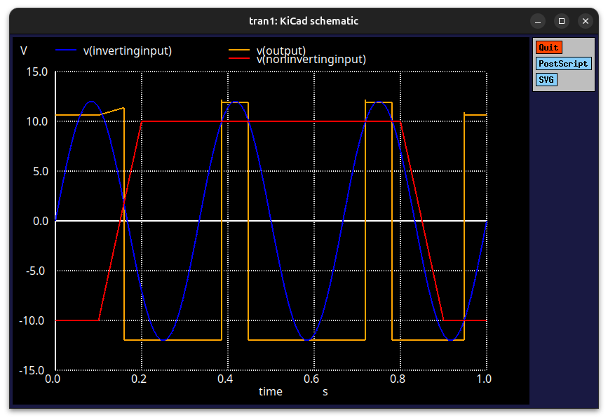
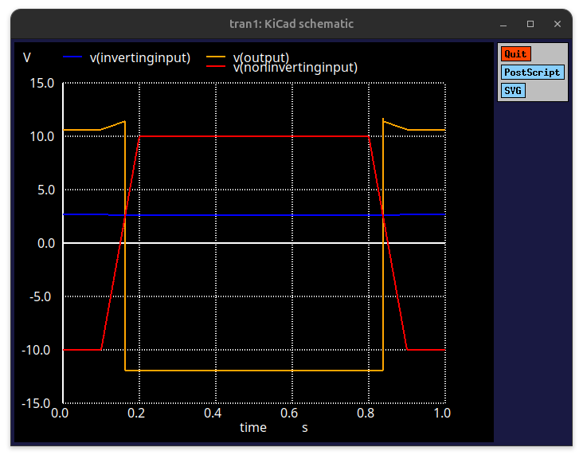

# Comparator
Discrete Comparator





## 🛠  Dependencies

This project requires the following dependencies:

### 🧱 Runtime & Build

  - **Ubuntu/Debian**:
    ```bash
    sudo apt install ngspice kicad
    ```

## Example
  - **Generate the Netlist**:
```
kicad-cli sch export netlist \
    --format spice \
    -o MainBoard/MainBoard.cir \
    MainBoard/MainBoard.kicad_sch
```
  - **Run the Simulation**:
```
ngspice MainBoard/MainBoard.cir
```


