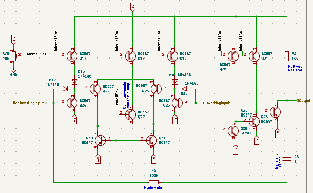
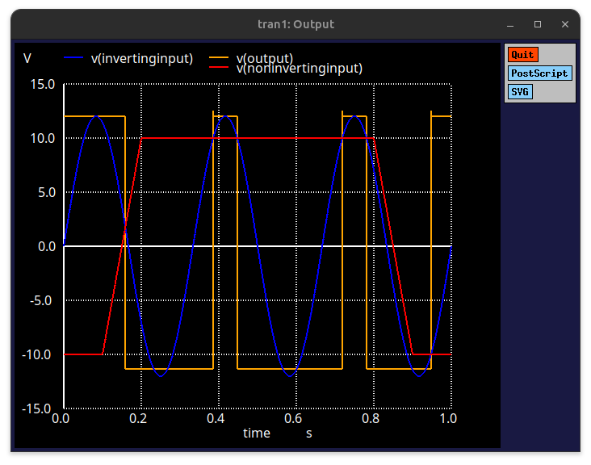
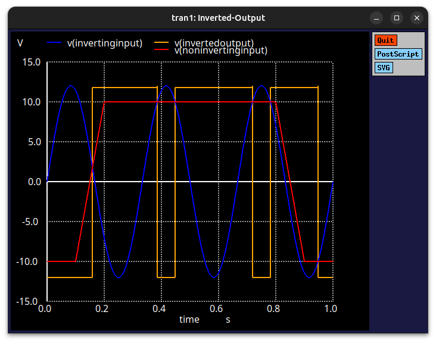
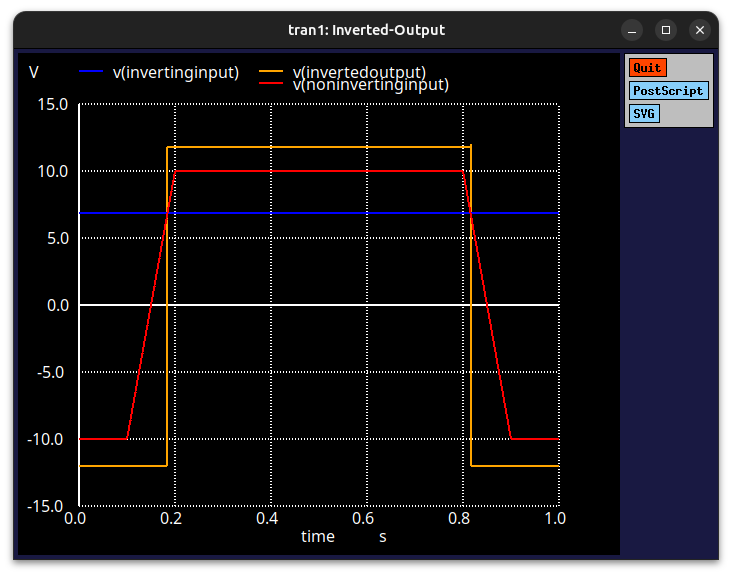

# Comparator
Discrete Comparator

## Runtime & Build
  - **Ubuntu/Debian**:
    ```bash
    sudo apt install ngspice kicad
    ```
  - **Generate the Netlist**:
    ```
    kicad-cli sch export netlist \
        --format spice \
        -o MainBoard/MainBoard.cir \
        MainBoard/MainBoard.kicad_sch
    ```
  - **Run the Simulation**:
    ```
    ngspice MainBoard/MainBoard.cir
    ```

## Schematic


## Simulation(s)
### Alternating Signal via Inverting Input


### Constant Signal via Inverting Input


